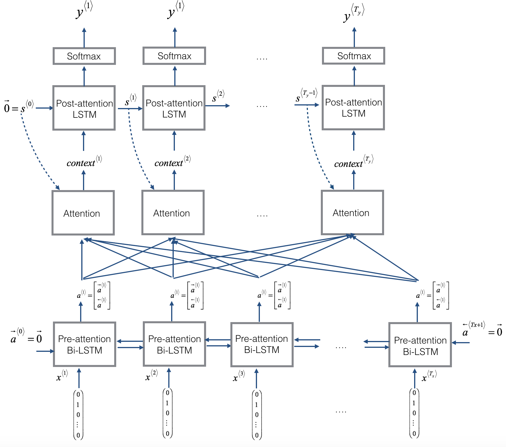

# Natural Machine Translation with Attention

Natural Machine Translation exercise Andrew Ng's deeplearning.ai.  

## Attention Model

Image Source: Andrew Ng's deeplearning.ai on Coursera

## Attention Mechanism

Image Source: Andrew Ng's deeplearning.ai on Coursera

## Blurb
In the exercise, the above model is used to translate from different  
date formats to a standard machine date format

## Run
To train and test the model:  
```python
python main.py
```

It will take a minute or two.  
In the end it just loads weights trained after many more epochs  
and outputs predictions for test data.
